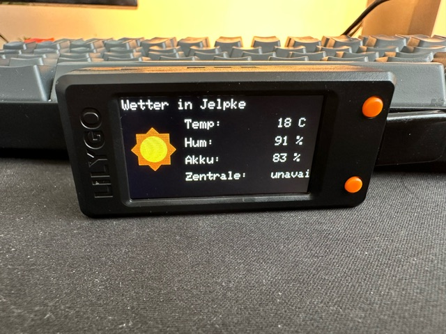
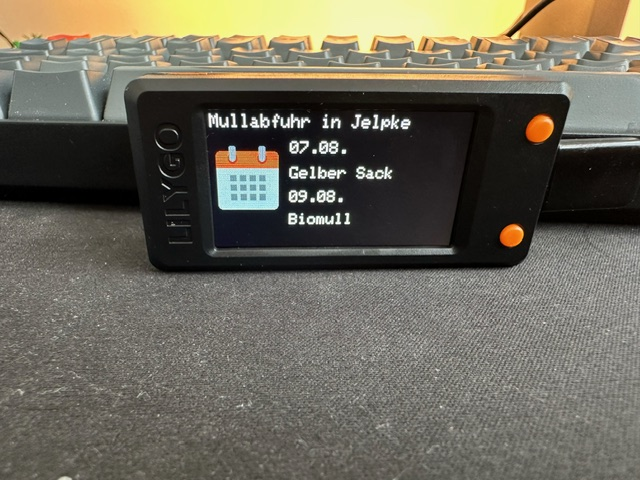
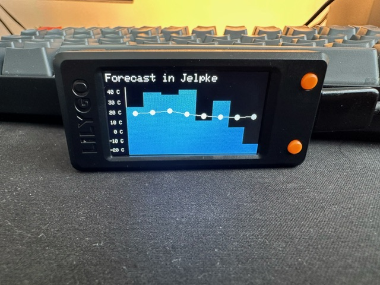

# LilyGo-S3-Homeassistant-Weatherstation

I'm sharing here a nice weekend project. I recently got this LilyGo-T-display-S3 with a nice dev housing. To test it's capabilities I tried to use it as small info/weatherstation for displaying my HomeAssistant Entites, calendar and forecast. 
I think this could be a great start for some other projects. 

Current three different screens are implemented:
- Current weather
- Calendar dates
- Weather forecast

Here you can see how the screen look like: 
Weather Screen | Calendar Screen | Forecast Screen |
--- | --- | --- |
 |  | |

Buttons can controll the screen:
- Upper Botton -> Switches to next View
- Lower Button -> Switch rotations (Currently only landscape is implemented)

### Installation

I used secrets.h to store my API keys. A template file can be found at secretsTemplate.h. 
Needed Informations:
- WiFi credentials - SSD & Password
- Homeassistant base url
- Homeassistant API Token - [How to get a Homeassistant long-live-access API Token](https://community.home-assistant.io/t/how-to-get-long-lived-access-token/162159)
- Your longitude and latitude
- OpenWeather API Token - [How to get a OpenWeaterAPI Token](https://docs.openweather.co.uk/appid)
- Homeassistant Entity Names you want to track
- Your Village name

Then follow the PlatformIO install instructions:

1. [Install PlatformIO](https://platformio.org/install)
2. Launch VisualStudioCode
2. Click the (✔) symbol in the lower left corner to compile
3. Connect the board to the computer USB
4. Click (→) to upload firmware
5. Click (plug symbol) to monitor serial output

### FAQ 
If you have any question, just let me know. 